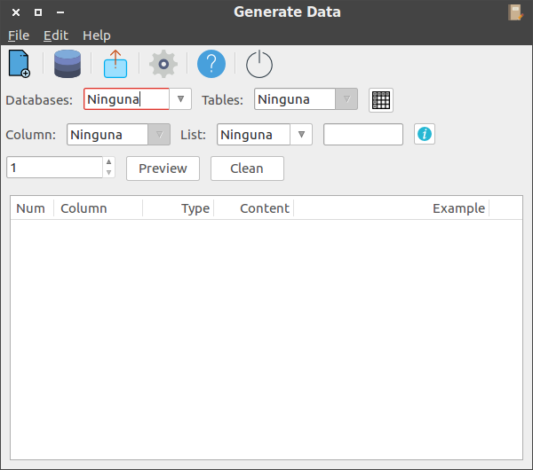

# Generador de datos
Generador de datos para mysql, permite crear 500 registros aleatorios para llenar tus tablas de mysql. Una caracteristica que diferencia a otros hasta ahora, es que puede añadirse datos en formas de lista, llamado diccionario del cual toma los datos de forma aleatoria.

## Toolbar
<ul>
    <li>Icono 1: Crear nuevo documento</li>
    <li>Icono 2: Conexion a la base de datos</li>
    <li>Icono 3: Exportar</li>
    <li>Icono 2: Preferencias</li>
    <li>Icono 4: Acerca de</li>
    <li>Icono 5: Cerrar</li>
</ul>

### Nuevo documento
Permite crear archivos que seran utilizadas para rellenar las columnas seleccionadas. Ejemplo, le das click y aparecera una ventana donde pondras los items en forma de lista, le pondras un nombre y podras utilizarlo en el combo list.

### Preferencias
En esta ventana podemos poner las bases de datos que no queremos que se muestren, estas pueden ser del sistema, tambien las columnas que no queremos que aparescan, como el id que es auto incrementable.

### Databases
En este archivo solo definimos los datos escenciales para la conexion a la base de datos.

## Interface
Si elegimos una base de datos y luego elegimos una tabla que corresponda a ella y presionamos el boton con icono de tabla, aparecera una ventana con la informacion de esa tabla de la base de datos, en esta se muestran los metadatos de cada columna.

Si ademas elegimos la columna de la tabla y un archivo del combo list podemos obtener los datos que se generaran y un ejemplo.
Es importante señalar que la caja de texto opciones permitira hacer algunas modificaciones a como saldra el datos.

## Ayuda
selecciona una lista y preciona el icono info, y saldra un alert donde te mostrara ayuda, amenos que que sea una lista añadida.  

<h2>Requirements</h2>
<ul>
	<li>wxpython: python-wxgtk3.0</li>
	<li>pymysql: PyMySQL</li>
	<li>python: >= 2.6 or >= 3.3 </li>
	<li>PyPy >= 4.0</li>
</ul>

<h2>License</h2>
MetaGenerator is released under the MIT License. See LICENSE for more information.

### contact
<small>Juankarlos.0304@gmail.com</small>
